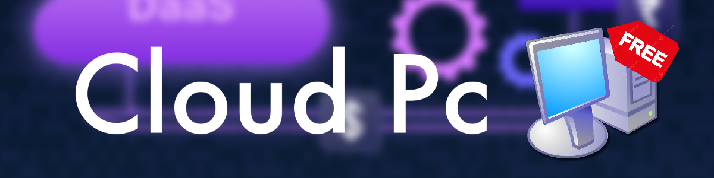

# GitHub Desktop Environment Setup

This repository provides an interactive **setup script** to install and run a desktop environment (DE) inside **GitHub Codespaces**. It includes support for a selection of stable DEs, allowing users to customize their experience based on preferences.


---

## 🚀 Features

- **Customizable Setup**: Choose from stable desktop environments like XFCE, GNOME, KDE Plasma, and LXQt.
- **Web-Based Access**: Seamlessly access your Codespace desktop using **VNC** and **noVNC** directly in your browser.
- **User-Friendly**: Guided installation process with explanations for every step.
- **Secure Access**: Automatically generates SSL certificates for encrypted noVNC connections.
- **Additional Tools**: Includes optional scripts to install extra applications and update to the latest Ubuntu LTS version.

---

## 📋 Requirements

- **GitHub Codespaces** with sufficient resources:
  - Recommended: At least 2 cores and 4 GB RAM.
- **Internet Connection**: Required for installing packages and accessing the desktop remotely.

---

## 📂 How to Use

### 1️⃣ Fork This Repository
- Click the **Fork** button in the top-right corner to create your own copy.

### 2️⃣ Open the Repository in GitHub Codespaces
- Navigate to your forked repository.
- Click **Code > Open with Codespaces** to start your Codespace.

### 3️⃣ Run the Setup Script
1. Open the **Terminal** in your Codespace.
2. Make the script executable:
   ```bash
   chmod +x setup.sh
   ```
3. Run the setup script:
   ```bash
   ./setup.sh
   ```
4. Follow the prompts to:
   - Select your desktop environment.
   - Customize your installation (optional).
   - Configure access and additional settings.

---

## 🖥️ Desktop Environments Available

During installation, you can choose from the following **stable** desktop environments:

1. **XFCE** (Recommended as the other DEs wont work :( )
2. **GNOME**
3. **KDE Plasma**
4. **LXQt**

The script installs the selected DE along with all required components for a smooth experience.

---

## 🌐 Access Your Desktop

After setup, access the desktop environment using the browser-based **noVNC** client:

1. Start the VNC server:
   ```bash
   vncserver :1
   ```
2. Start noVNC:
   ```bash
   websockify -D --web=/usr/share/novnc/ --cert=$HOME/novnc.pem 6081 localhost:5901
   ```
3. Open the browser and navigate to:
   ```
   https://<your-codespace-url>:6081
   ```
4. Enter your VNC password when prompted.

---

## 🔄 Re-entering Your Codespace

GitHub Codespaces automatically stops after 1 hour of inactivity. When restarting, follow these steps:

1. Kill any existing VNC session:
   ```bash
   vncserver -kill :1
   ```
2. Restart the VNC server:
   ```bash
   vncserver :1
   ```
3. Restart noVNC:
   ```bash
   websockify -D --web=/usr/share/novnc/ --cert=$HOME/novnc.pem 6081 localhost:5901
   ```

---

## ❓ FAQ

### 1️⃣ My Codespace is gone. What happened?
Codespaces are automatically deleted after 1 month unless you toggle the auto-deletion setting off.

### 2️⃣ Can I install multiple desktop environments?
Yes, you can install multiple DEs, but we recommend sticking to one for better performance and stability.

### 3️⃣ Which desktop environment is best for performance?
**XFCE** is lightweight and provides the best performance in a Codespace environment.

### 4️⃣ How do I customize the desktop environment?
The setup script allows you to apply themes and install additional tools specific to your selected DE.

### 5️⃣ Can I access my desktop from another computer?
Yes, as long as you have the Codespace URL and access to your GitHub account.

### 6️⃣ Is my Codespace secure?
Yes, the script generates SSL certificates to encrypt connections via noVNC.

### 7️⃣ What happens if my Codespace stops?
You can restart it from your GitHub Codespaces dashboard and reinitialize the VNC server and noVNC.

### 8️⃣ Can I update my Ubuntu version later?
Yes, use the optional `update.sh` script in this repository to upgrade to the latest LTS version.

### 9️⃣ How do I install additional applications?
Run the `tools.sh` script to install common tools and applications.

### 🔟 What are the minimum requirements for this setup?
We recommend at least 2 cores and 4 GB of RAM for a smooth experience.

---

## 🌟 Showcase 


---

## 📖 License

This project is licensed under the MIT License. See the [LICENSE](LICENSE) file for details.

---

## 🤝 Contributing

Contributions are welcome! If you have ideas for improvements or new features, feel free to open an issue or submit a pull request.
